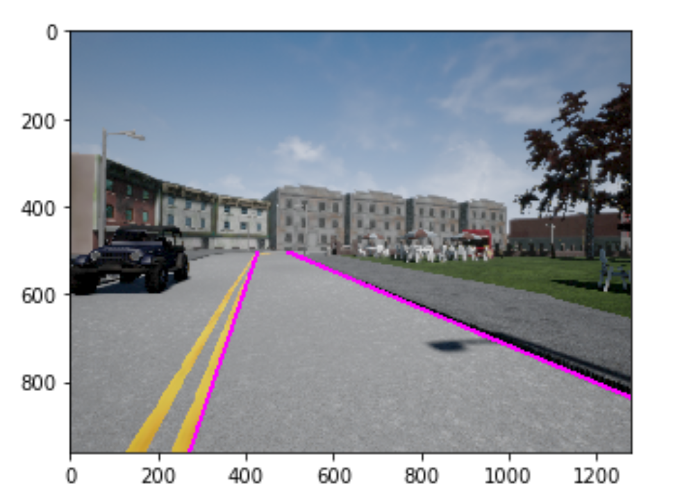

# Environment-Perception-for-Autonomous-Vehicle

The m6bk.py , images and skeleton-code for Environement-Perception were provided by the Instructors from the Coursera Course .

In this Notebook , we use the output of semantic segmentation neural networks to implement drivable space estimation in 3D and lane estimation , also we use the output of semantic segmentation to filter errors in the output of 2D object detectors. finally we 
use the filtered 2D object detection results to determine how far obstacles are from the self-driving car.

As this is a final assignement in the Visual Pereption Course from Coursera , I hope that you'll try at least 2 or 3 hours working by yourself on the assignement before considering using this solution.

  

  
